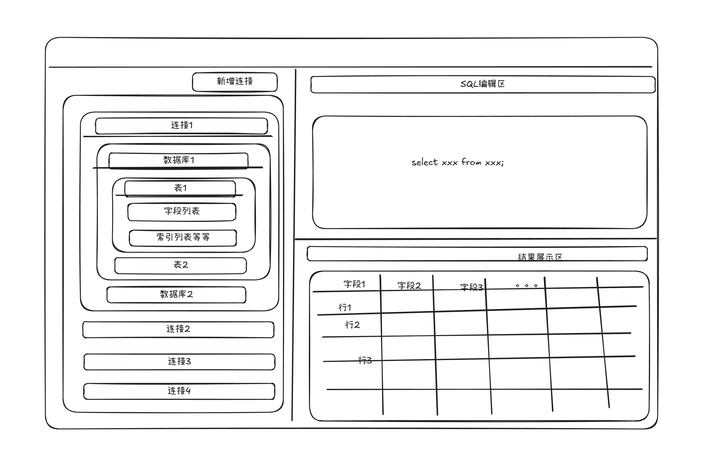

# 智能SQLer

<div align="center">
  
  <h3>AI驱动的SQL智能助手</h3>
  <p>通过自然语言生成、优化和理解SQL，提高数据库操作效率</p>
  <br/>
</div>

智能SQLer是一款基于AI智能化后的数据库管理工具，旨在简化数据库操作，提高工作效率。通过集成先进的AI技术，智能SQLer能够自动生成SQL查询语句、优化数据库性能，并提供智能化的数据分析功能。

## 🔨 当前版本功能

- **后端框架**: 基于Rust 1.91 + Axum构建
- **AI服务集成**: 已完成OpenAI GPT API集成，实现SQL生成、优化和解释
- **安全防护**: 实现SQL注入防护机制、输入验证和敏感词汇检测
- **测试覆盖**: 编写完整的单元测试和集成测试
- **模板系统**: 开发提示词模板管理功能

## 📁 项目结构

```
smart-sql/
├── backend/         # Rust后端代码
│   ├── src/         # 源代码
│   ├── tests/       # 测试代码
│   └── Cargo.toml   # Rust项目配置
├── frontend/        # Svelte前端代码
├── config/          # 配置文件
├── docs/            # 文档
└── img/             # 图片资源
```


## 主要功能

- **自动SQL生成**：用户只需描述所需的数据操作，智能SQLer即可自动生成相应的SQL查询语句，减少手动编写SQL的时间和错误率。
- **性能优化建议**：智能SQLer能够分析数据库的运行状况，提供性能优化建议，帮助用户提升数据库的响应速度和处理能力。
- **智能数据分析**：通过AI技术，智能SQLer可以对数据库中的数据进行深入分析，生成可视化报表和洞察，辅助用户做出更明智的决策。
- **多数据库支持**：支持多种主流数据库系统，如MySQL、PostgreSQL、SQLite等，满足不同用户的需求。

## 页面设计


### 页面设计特点

1. 页面主要采用左右结构设计，左侧为数据库列表，右侧为SQL编辑区和结果展示区。
2. 顶部导航栏包含项目名称“智能SQLer”和用户信息，方便用户识别和管理。
3. 左侧数据库列表支持搜索和筛选功能，用户可以快速定位所需的数据库。
4. SQL编辑区提供语法高亮和自动补全功能，提升用户的编写效率。
5. 结果展示区以表格形式展示查询结果，并支持导出功能，方便用户保存和分享数据。
6. 整体页面设计简洁明了，注重用户体验，确保用户能够高效地进行数据库管理和操作。
7. 页面配色采用柔和的蓝色和白色为主，营造专业且舒适的使用环境

### 具体功能说明

#### 左侧数据库列表功能

1. 数据库连接列表：左侧栏显示用户已连接的连接，支持按名称、类型等条件进行搜索和筛选，方便用户快速找到目标数据库。
2. 双击某个连接后，展开显示该连接下的所有数据库，用户可以选择需要操作的数据库。
3. 点击某个数据库后，展开显示该数据库下的所有表，用户可以选择需要操作的表。
4. 点击某个表后，展开限制字段定义、索引等信息，方便用户了解表结构。
5. 选择表鼠标右击后，弹出操作菜单，包含“查看数据”、“编辑表结构”、“删除表”等常用操作。
6. 点击查看数据后，右侧SQL编辑区自动生成“SELECT * FROM 表名;”语句，用户可以直接执行或修改该语句。默认查询100条数据，用户可在设置中调整默认查询条数。
7. 点击编辑表结构后，弹出表结构编辑窗口，用户可以修改字段类型、添加索引等操作。
8. 点击删除表后，弹出确认对话框，防止误操作。

#### 右侧SQL编辑区

1. SQL编辑器：右侧上方为SQL编辑区，支持语法高亮、自动补全和错误提示功能，提升用户的编写效率。
2. 执行按钮：编辑区上方提供“执行”按钮，用户可以点击该按钮执行编辑区中的SQL语句。
3. AI辅助功能：编辑区右侧提供AI助手按钮，用户可以点击该按钮，输入自然语言描述，智能SQLer将自动生成相应的SQL语句并填入编辑区。
4. 历史记录：编辑区下方提供历史记录功能，用户可以查看和管理之前执行过的SQL语句，方便重复使用。
5. SQL收藏夹：用户可以将常用的SQL语句保存到收藏夹中，方便随时调用。

#### 结果展示区

1. 查询结果表格：右侧下方为结果展示区，以表格形式展示SQL查询结果，支持分页显示，方便用户浏览大量数据。
2. 数据导出功能：结果展示区提供导出按钮，用户可以将查询结果导出为CSV、Excel等格式，方便保存和分享数据。
3. 结果过滤和排序：用户可以对查询结果进行过滤和排序操作，快速定位所需数据。
4. 结果统计功能：结果展示区提供统计功能，用户可以对查询结果进行简单的统计分析，如计数、求和、平均值等。
5. 可视化图表：结果展示区支持将查询结果生成可视化图表，如柱状图、折线图、饼图等，帮助用户更直观地理解数据。

## 🛠️ 技术栈

### 后端
- **语言**: Rust 1.91
- **Web框架**: Axum
- **数据库驱动**: 支持多种数据库连接
- **AI集成**: OpenAI GPT API
- **配置管理**: serde + toml
- **测试框架**: cargo test + rstest

### 前端
- **框架**: Svelte
- **语言**: TypeScript
- **样式**: Tailwind CSS

## 📋 快速开始

### 后端设置

1. 配置环境变量
```bash
# 编辑.env文件，添加OpenAI API密钥等配置
```

2. 构建并运行后端
```bash
cd backend
cargo build --release
cargo run --release
```

### 🔒 安全措施

- 实现了严格的输入验证和长度限制
- 内置SQL注入防护机制
- 敏感信息脱敏处理
- 请求频率限制

## 📚 文档

- [开发指南](./docs/development/)
- [测试指南](./docs/development/testing-guide.md)
- [API文档](./docs/api/)
- [发布说明](./docs/release-notes.md)

## 📄 许可证

本项目采用MIT许可证

## 🚀 发展规划

### 桌面应用化（v2.0+）
**项目定位**：智能SQLer的最终目标是成为**跨平台桌面应用**（Windows、Mac），为用户提供本地化的数据库管理体验。

**技术路线**：
- **Phase 1（当前）**: Web应用 - 基于Rust + Svelte构建现代化Web界面
- **Phase 2（计划中）**: 桌面应用 - 使用Tauri框架将Web前端打包为原生桌面应用
  - 优势：复用现有前后端代码，打包体积小（<10MB）
  - 特性：原生菜单栏、系统托盘、本地文件访问、离线运行
  - 支持平台：Windows 10+, macOS 10.15+, Linux

### 功能扩展
- **多数据库支持**: MySQL、PostgreSQL、SQL Server、MongoDB
- **多语言支持**：英文、日文等国际化支持
- **数据可视化**: ER图生成、查询结果图表化展示
- **协作功能**: 查询共享、团队模板库