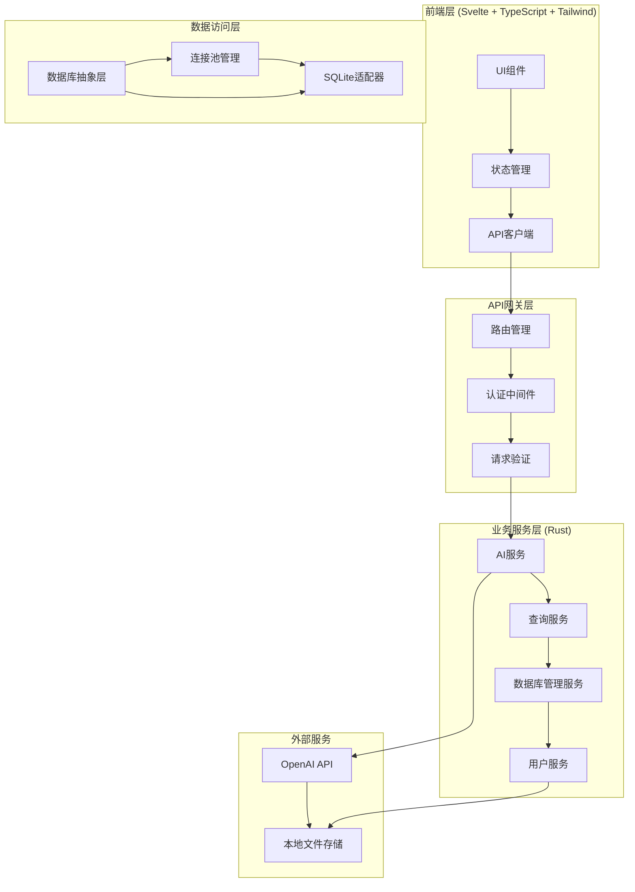
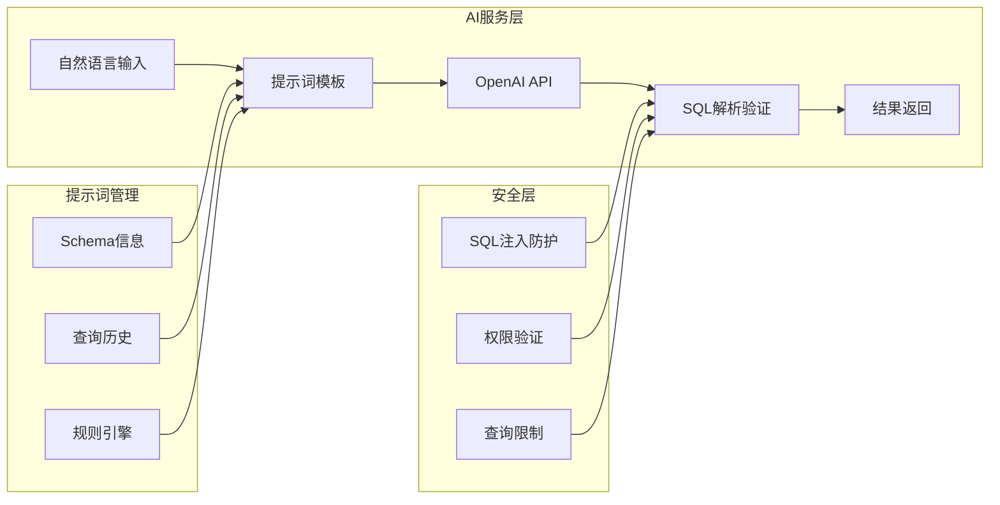

# 智能SQLer系统架构设计

## 1. 整体系统架构

### 🏗️ 分层架构设计



### 📁 项目目录结构

```
smart-sql/
├── backend/                 # Rust API服务
│   ├── src/
│   │   ├── main.rs
│   │   ├── config/          # 配置管理
│   │   ├── models/          # 数据模型
│   │   ├── services/        # 业务逻辑
│   │   │   ├── ai.rs        # AI服务
│   │   │   ├── database.rs  # 数据库服务
│   │   │   └── query.rs     # 查询服务
│   │   ├── adapters/        # 数据库适配器
│   │   │   ├── sqlite.rs    # SQLite适配器
│   │   │   └── mod.rs       # 抽象接口
│   │   ├── handlers/        # HTTP处理器
│   │   ├── middleware/      # 中间件
│   │   └── utils/           # 工具函数
│   └── Cargo.toml
├── frontend/                # Svelte + TypeScript前端
│   ├── src/
│   │   ├── lib/
│   │   │   ├── components/  # Svelte组件
│   │   │   ├── stores/      # 状态管理
│   │   │   ├── services/    # API服务
│   │   │   └── types/       # TypeScript类型定义
│   │   ├── routes/          # 页面路由
│   │   ├── app.html         # 应用入口
│   │   └── app.css          # 样式文件
│   ├── static/              # 静态资源
│   ├── tests/               # 测试文件
│   ├── svelte.config.js     # Svelte配置
│   ├── vite.config.ts       # Vite构建配置
│   ├── package.json         # 依赖配置
│   └── tsconfig.json        # TypeScript配置
├── docs/                    # 文档
└── README.md
```

## 2. 数据库抽象层设计

### 🔄 适配器模式实现

```rust
// 数据库适配器trait定义
pub trait DatabaseAdapter: Send + Sync {
    async fn connect(&self) -> Result<(), DatabaseError>;
    async fn get_schema(&self) -> Result<DatabaseSchema, DatabaseError>;
    async fn execute_query(&self, sql: &str) -> Result<QueryResult, DatabaseError>;
    async fn execute(&self, sql: &str) -> Result<u64, DatabaseError>;
    fn get_database_type(&self) -> DatabaseType;
}

// 连接管理器
pub struct ConnectionManager {
    adapters: HashMap<String, Arc<dyn DatabaseAdapter>>,
}
```

### 🗄️ 数据模型设计

```rust
/// 数据库Schema信息
#[derive(Debug, Clone, Serialize, Deserialize)]
pub struct DatabaseSchema {
    pub database_type: String,
    pub tables: Vec<TableInfo>,
}

/// 表信息
#[derive(Debug, Clone, Serialize, Deserialize)]
pub struct TableInfo {
    pub name: String,
    pub columns: Vec<ColumnInfo>,
    pub indexes: Vec<IndexInfo>,
}

/// 查询结果
#[derive(Debug, Clone, Serialize, Deserialize)]
pub struct QueryResult {
    pub columns: Vec<String>,
    pub rows: Vec<Vec<String>>,
    pub row_count: usize,
    pub execution_time: u64,
}
```

## 3. AI服务架构

### 🤖 AI服务架构图



### 📝 提示词模板系统

```rust
pub struct PromptTemplate {
    base_template: String,
    database_context: String,
    safety_rules: String,
}

impl PromptTemplate {
    pub fn generate_sql_prompt(&self, schema: &DatabaseSchema, query: &str) -> String {
        format!(
            "{}\n\n数据库Schema:\n{}\n\n用户查询: {}\n\n安全规则: {}\n\n请只返回纯粹的SELECT SQL语句，不要任何解释。",
            self.base_template,
            self.format_schema(schema),
            query,
            self.safety_rules
        )
    }
}
```

## 4. 前端架构设计

### 🎨 Svelte组件层次结构

```
+layout.svelte (根布局)
├── Header.svelte (头部导航)
├── MainContainer.svelte (主内容区)
│   ├── LeftPanel.svelte (左侧面板)
│   │   ├── DatabaseTree.svelte (数据库树形结构)
│   │   └── ConnectionManager.svelte (连接管理)
│   └── RightPanel.svelte (右侧面板)
│       ├── SqlEditor.svelte (SQL编辑器)
│       └── QueryResults.svelte (查询结果)
└── Statusbar.svelte (状态栏)
```

### 🔄 Svelte状态管理架构

```typescript
// stores/app-store.ts - Svelte Store
import { writable, derived } from 'svelte/store';

interface DatabaseConnection {
    id: string;
    name: string;
    type: 'SQLite' | 'MySQL' | 'PostgreSQL';
    connectionString: string;
}

interface QueryResult {
    columns: string[];
    rows: string[][];
    executionTime: number;
}

// 可写状态
export const databaseConnections = writable<Map<string, DatabaseConnection>>(new Map());
export const activeDatabaseId = writable<string | null>(null);
export const queryHistory = writable<string[]>([]);
export const currentQuery = writable<string>('');
export const queryResults = writable<QueryResult | null>(null);
export const loading = writable<boolean>(false);
export const error = writable<string | null>(null);

// 计算状态
export const activeDatabase = derived(
    [databaseConnections, activeDatabaseId],
    ([$connections, $activeId]) => $activeId ? $connections.get($activeId) : null
);

export const hasResults = derived(
    queryResults,
    $results => !!$results && $results.rows.length > 0
);
```

### 🛠️ Svelte + TypeScript 组件示例

```typescript
// src/lib/components/SqlEditor.svelte
<script lang="ts">
    import { createEventDispatcher } from 'svelte';
    import { currentQuery, loading } from '$lib/stores/app-store';

    export let placeholder = '请输入SQL查询语句...';

    let textareaElement: HTMLTextAreaElement;
    let localValue = '';

    const dispatch = createEventDispatcher();

    // 响应式绑定
    $: currentQuery.set(localValue);

    function executeQuery() {
        if (localValue.trim()) {
            dispatch('execute', { sql: localValue.trim() });
        }
    }

    function handleKeydown(event: KeyboardEvent) {
        if (event.ctrlKey && event.key === 'Enter') {
            event.preventDefault();
            executeQuery();
        }
    }
</script>

<div class="sql-editor">
    <div class="editor-toolbar">
        <button
            class="btn btn-primary"
            on:click={executeQuery}
            disabled={$loading}
        >
            {#if $loading}
                <span class="animate-spin">⟳</span> 执行中...
            {:else}
                ▶ 执行
            {/if}
        </button>
    </div>
    <textarea
        bind:this={textareaElement}
        bind:value={localValue}
        on:keydown={handleKeydown}
        {placeholder}
        class="editor-textarea"
    ></textarea>
</div>

<style>
    .sql-editor {
        display: flex;
        flex-direction: column;
        height: 100%;
    }

    .editor-toolbar {
        padding: 8px;
        border-bottom: 1px solid #e5e7eb;
        display: flex;
        gap: 8px;
    }

    .editor-textarea {
        flex: 1;
        padding: 12px;
        font-family: 'Consolas', 'Monaco', monospace;
        font-size: 14px;
        line-height: 1.5;
        border: none;
        outline: none;
        resize: none;
    }

    .btn {
        padding: 8px 16px;
        border-radius: 6px;
        font-weight: 500;
        cursor: pointer;
        transition: all 0.2s;
    }

    .btn-primary {
        background-color: #3b82f6;
        color: white;
        border: 1px solid #3b82f6;
    }

    .btn-primary:hover:not(:disabled) {
        background-color: #2563eb;
    }

    .btn:disabled {
        opacity: 0.5;
        cursor: not-allowed;
    }

    .animate-spin {
        animation: spin 1s linear infinite;
    }

    @keyframes spin {
        from { transform: rotate(0deg); }
        to { transform: rotate(360deg); }
    }
</style>
```

## 5. API设计规范

### 🛣️ RESTful API 设计

```
POST   /api/ai/generate-sql        # 生成SQL
POST   /api/database/execute       # 执行查询
GET    /api/database/schema        # 获取数据库结构
POST   /api/database/connect       # 连接数据库
GET    /api/database/connections   # 获取连接列表
DELETE /api/database/connections/{id}  # 断开连接
POST   /api/database/export        # 导出数据
GET    /api/query/history          # 查询历史
GET    /api/ai/suggestions         # AI建议
```

### 📋 请求响应格式

```json
// 统一响应格式
{
    "success": true,
    "data": { ... },
    "error": null,
    "timestamp": "2024-01-01T12:00:00Z"
}

// 生成SQL请求
{
    "query": "查询所有年龄大于18岁的用户",
    "database_id": "default",
    "context": {
        "tables_used": ["users"],
        "similar_queries": []
    }
}

// 生成SQL响应
{
    "success": true,
    "data": {
        "sql": "SELECT * FROM users WHERE age > 18",
        "confidence": 0.92,
        "explanation": "查询users表中年龄字段大于18的所有记录",
        "estimated_rows": 150
    }
}
```

## 6. 安全架构

### 🔒 安全防护层次

```
┌─────────────────────────────────────┐
│           前端安全层                  │
│  输入验证、XSS防护、CSRF防护          │
├─────────────────────────────────────┤
│           API安全层                   │
│  请求限流、参数验证、认证授权          │
├─────────────────────────────────────┤
│           业务安全层                   │
│  SQL注入防护、访问控制、审计日志       │
├─────────────────────────────────────┤
│           数据访问层                   │
│  连接池隔离、权限最小化、加密传输      │
└─────────────────────────────────────┘
```

### 🛡️ 安全措施

1. **SQL注入防护**: 参数化查询、语法验证
2. **访问控制**: 数据库权限隔离、查询限制
3. **数据保护**: 敏感信息加密存储、传输加密
4. **审计日志**: 操作记录、异常监控
5. **限流保护**: API调用频率限制、查询复杂度限制

## 7. 性能架构

### ⚡ 性能优化策略

```
前端性能优化:
├── 组件懒加载
├── 代码分割
├── 资源缓存
└── 虚拟滚动

API性能优化:
├── 连接池复用
├── 查询缓存
├── 结果分页
└── 异步处理

数据库性能优化:
├── 索引建议
├── 查询计划分析
├── 结果集流式处理
└── 连接池管理
```

### 📊 性能监控指标

- **响应时间**: API < 200ms, 查询 < 2s
- **吞吐量**: 并发支持 > 100 用户
- **资源占用**: 内存 < 512MB, CPU < 50%
- **可用性**: SLA 99.9%

## 8. 扩展性设计

### 🔧 水平扩展能力

- **数据库扩展**: 支持MySQL、PostgreSQL等
- **AI服务扩展**: 支持多个AI供应商
- **部署扩展**: 支持分布式部署
- **存储扩展**: 支持文件存储、对象存储

### 🎯 模块化设计原则

- **松耦合**: 模块间通过接口通信
- **高内聚**: 单一职责原则
- **可替换**: 组件易于替换升级
- **可测试**: 完整的测试覆盖

这个架构设计为智能SQLer提供了坚实的技术基础，确保系统的可扩展性、安全性和性能表现。